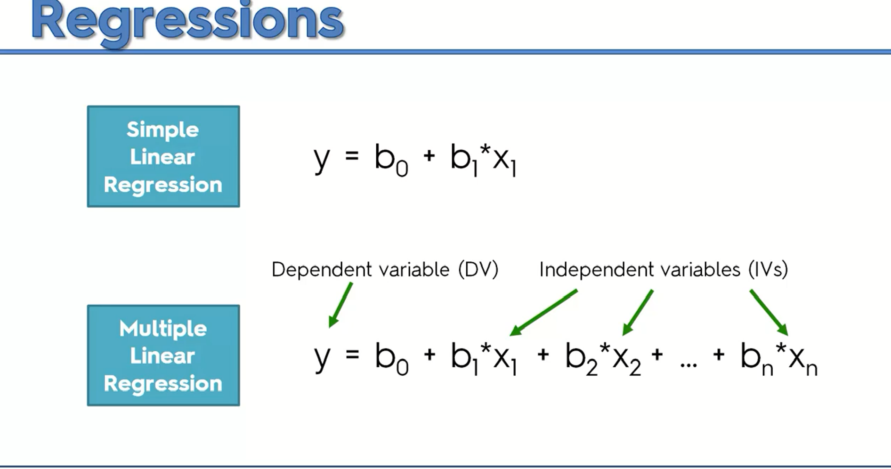
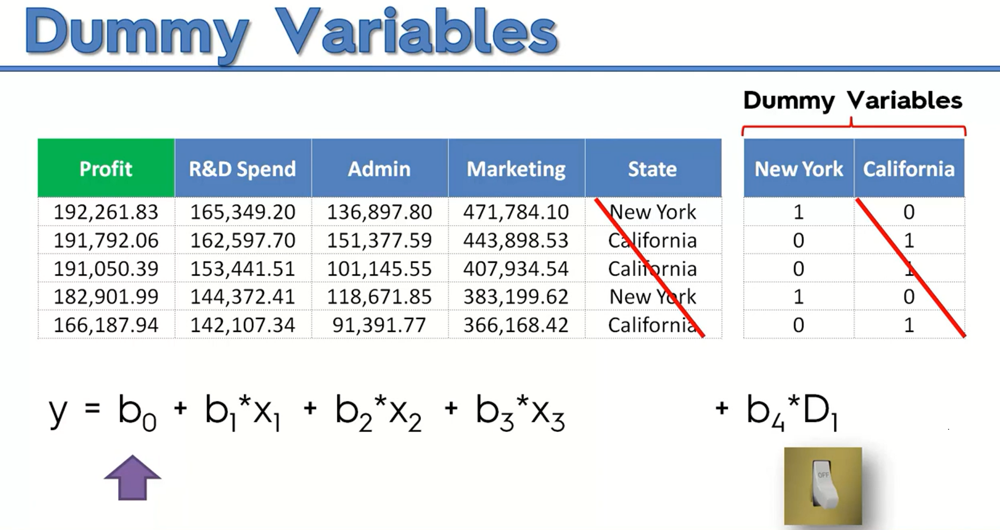

# Multiple-Linear-Regression
Demonstration of developing a  model which would derive the relationship between the output and input data this is a similar case of
linear regression but in this case, we have more than one variable which is contributing to the output. Consider the following diagram. 

As we have multiple variables sometimes we have numerical values like salary, age while sometimes have text days like the name of the city, name of the guide and many more. So how to handle those data well we create dummy variables for example in the below diagram we have a situation where we have two type of cities so to represent one we would use 1 while for another we would use 0. We can just use a different variable for city two because of many problems which can arise due to creating more dummy variable like in this one instead of using another variable for another city we can just use (d1-1). For more detail, I'll add more exams in the future so let's build a model which can do this. 

